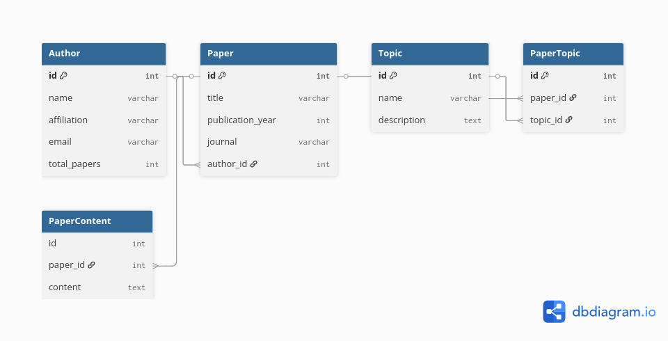

# Research Paper Repository Manager

A command-line application for managing research papers, authors, and topics. Built with Python, SQLAlchemy, and Click.

## Features

- **Author Management**: Add and view authors with affiliations and contact information
- **Paper Management**: Store research papers with publication details
- **Topic Organization**: Categorize papers by research topics
- **Search & Filter**: Find papers by year, topic, or author
- **Favorites System**: Mark important papers as favorites
- **Statistics**: View repository statistics and insights
- **Content Storage**: Store paper abstracts and content

## Prerequisites

- Python 3.8 or higher
- pip (Python package installer)
- pipenv (recommended) or virtualenv

## Installation

### Option 1: Using Pipenv (Recommended)

1. **Clone the repository**
   ```bash
   git clone https://github.com/lewys-miugo/research-repo-cli.git
   cd research-repo
   ```

2. **Install pipenv if you don't have it**
   ```bash
   pip install pipenv
   ```

3. **Install dependencies and create virtual environment**
   ```bash
   pipenv install
   ```

4. **Activate the virtual environment**
   ```bash
   pipenv shell
   ```

### Option 2: Using pip and virtualenv

1. **Clone the repository**
   ```bash
   git clone https://github.com/lewys-miugo/research-repo-cli.git
   cd research-repo
   ```

2. **Create virtual environment**
   ```bash
   python -m venv venv
   source venv/bin/activate  # On Windows: venv\Scripts\activate
   ```

3. **Install dependencies**
   ```bash
   pip install sqlalchemy alembic click
   ```

## Database Setup

The application uses SQLite database with Alembic for migrations.

1. **Initialize the database**
   ```bash
   python -c "from models import *"
   ```

   The database file `research_papers.db` will be created automatically when you first run the application.

## Usage

### Running the Application

```bash
python app.py
```

### Main Menu Options

1. **Authors** - Manage research authors
   - Add new authors
   - View all authors
   - View papers by specific author

2. **Papers** - Manage research papers
   - Add new papers with topics and content
   - View all papers

3. **Topics** - Manage research topics
   - Add new topics
   - View all topics

4. **Search & Favorites** - Search and bookmark papers
   - Search papers by publication year
   - Search papers by topic
   - Toggle paper favorites
   - View favorite papers

5. **Statistics** - View repository insights
   - Total counts of papers, authors, topics
   - Most popular topics
   - Most active authors

### Example Workflow

1. **Add an Author**
   ```bash
   Select Option: 1 (Authors)
   Select Author Option: 1 (Add New Author)
   Enter author name: John Doe
   Enter affiliation: MIT
   Enter email: john.doe@mit.edu
   ```

2. **Add a Paper**
   ```bash
   Select Option: 2 (Papers)
   Select Paper Option: 1 (Add New Paper)
   Enter paper title: Machine Learning in Healthcare
   Enter publication year: 2023
   Enter journal: Nature Medicine
   Enter author name: John Doe
   Add topics to this paper? y
   Enter topic name: Machine Learning
   Enter topic name: Healthcare
   Enter topic name: (press Enter to finish)
   Add content/abstract to this paper? y
   Enter paper content/abstract: This paper explores...
   ```

3. **Search Papers**
   ```bash
   Select Option: 4 (Search & Favorites)
   Select Search Option: 2 (Search Papers by Topic)
   Enter topic name: Machine Learning
   ```

## Project Structure

```bash
research-repo/
├── app.py              # Main CLI application
├── models.py           # SQLAlchemy database models
├── crud.py             # Database operations
├── alembic.ini         # Alembic configuration
├── alembic/            # Database migrations
├── Pipfile             # Pipenv dependencies
├── Pipfile.lock        # Locked dependencies
└── README.md           # This file
```

## Database Schema

- **Authors**: Store author information and paper counts
- **Papers**: Store paper details with author relationships
- **Topics**: Store research topic categories
- **PaperTopics**: Many-to-many relationship between papers and topics
- **PaperContents**: Store paper abstracts and full content



## Dependencies

- **SQLAlchemy**: ORM for database operations
- **Alembic**: Database migration tool
- **Click**: Command-line interface framework

## Troubleshooting

### Common Issues

1. **Database file not found**
   - The database is created automatically on first run
   - Ensure you have write permissions in the project directory

2. **Import errors**
   - Make sure you're in the virtual environment
   - Verify all dependencies are installed

3. **Permission errors**
   - Ensure you have read/write permissions in the project directory

### Getting Help

If you encounter issues:
1. Check that all dependencies are installed correctly
2. Ensure you're using Python 3.8 or higher
3. Verify the virtual environment is activated
4. Check file permissions in the project directory

## Contributing

1. Fork the repository
2. Create a feature branch
3. Make your changes
4. Test thoroughly
5. Submit a pull request

## License

This project is open source and available under the [MIT License](LICENSE).